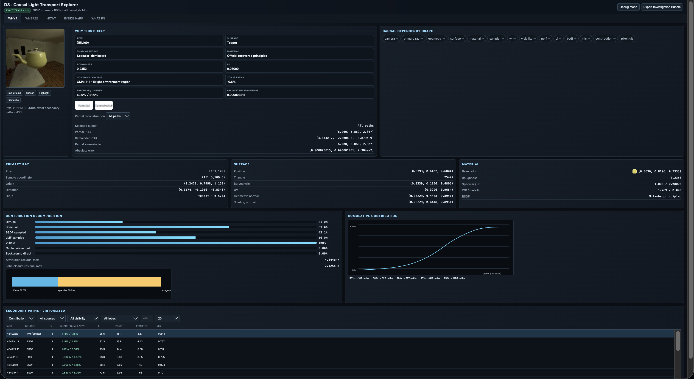

<p align="center">
  
</p>

# NeRF LightPath Explorer

A reconstruction and interactive extension of my earlier research work on decomposed neural-environment and explicit-surface light transport for physics-based inverse rendering. The system turns pixel formation into an inspectable causal process: every displayed explanation is connected to saved renderer paths or a deterministic retrace.

## Project origin

This repository reconstructs and packages a research prototype I worked on during September 2023 – January 2024, focusing on decomposed neural-environment / explicit-surface light transport for physics-based inverse rendering.

The current version rebuilds that prototype as an independent, inspectable implementation and extends it with exact per-pixel path attribution and causal interactive analysis. The completed prototype was organized and packaged for public presentation after the original research period.

## Core idea

The scene representation separates environment illumination from the object that will be inspected or edited:

```text
Captured HDR scene
        ↓
Neural radiance field
        ↓  remove object-region density
Environment-only neural radiance representation ───────┐
                                                       │ environment radiance
Explicit object geometry + explicit editable material ├→ physically based transport
                                                       │
                                                       └→ rendered pixel
                                                               ↓
                                                     exact per-pixel path trace
                                                               ↓
                                                     causal interactive explorer
```

The neural field handles environment radiance. The explicit object handles geometry and material. Visibility, sampling, BSDF evaluation and multiple importance sampling are evaluated explicitly between the two representations.

## Causal light transport

This is not only a renderer debugger. It treats pixel formation as an inspectable causal chain:

```text
Camera
  ↓
Primary ray
  ↓
Geometry
  ↓
Surface state ─────────────── Material
  │                              │
  └──────── Sampling proposal    │
                 ↓               │
                 wi              │
            ┌────┴────┐          │
            ↓         ↓          │
       Visibility  Environment   │
                    radiance     │
                       ↓         │
                       Li        │
            └────┬─────┘         │
                 ↓               ↓
                        BSDF
                          ↓
                         MIS
                          ↓
                  Path contribution
                          ↓
                      Pixel RGB
```

The explorer supports five operations over this chain: observe the current state, attribute energy to causes, drill down to one path, intervene on selected variables and recompute downstream effects.

## Interactive explorer

The interface is organized around five causal questions:

- **WHY? — Why does this pixel have this color?** Inspect its material state, diffuse/specular energy, sampling sources, visibility and ranked path contributions.
- **WHERE? — Which directions and environment regions contribute the energy?** Explore incident rays, occlusion, spatial GMM components and vMF directions in an interactive WebGL view.
- **HOW? — How does one sampled path become an RGB contribution?** Follow its sampled direction through visibility, incident radiance, BSDF, PDFs, MIS weight and the exact numerical estimator.
- **INSIDE NeRF — How is incident radiance accumulated along a neural volume ray?** Inspect density, alpha, transmittance, weights and RGB accumulation for a clearly labelled diagnostic retrace.
- **WHAT IF? — What changes when a causal variable is intervened on?** Compare controlled material-response changes with a complete deterministic pixel rerender.

Selection is bidirectional: choosing a table row highlights the same 3D ray, while selecting a ray updates its path row and dependent panels. Pixel, path, mode and tab are encoded in the URL for reproducible investigations.

## From pixel to cause

For the bundled highlight pixel `(151, 109)`, the interface moves from the final color to increasingly specific physical causes:

```text
Final pixel
    ↓
Contribution ranking
    ↓
Top light paths
    ↓
Selected path
    ↓
Sampling → visibility → Li → BSDF → MIS
    ↓
Exact RGB contribution
```

The explanation is computed from real saved renderer paths. It is not a post-hoc natural-language account. Selecting a path exposes the values used in its estimator and shows how the Gaussian reconstruction filter carries that sample into the final pixel.

## Causal interventions

### Frozen-path intervention

The camera, geometry, sampled incident directions (`wi`), visibility and environment radiance (`Li`) remain fixed. A material parameter changes, then the system recomputes the BSDF, any dependent MIS term, path contributions and pixel RGB.

This answers: **if the object received exactly the same incident light, how would only its material response change the pixel?**

### Full rerender intervention

After a material change, the proposal distribution, sampled directions, visibility, incident radiance, PDFs and MIS terms may all be recomputed using deterministic seeds.

This answers: **if the pixel were genuinely rendered again under the edited material, what would it become?**

The two modes answer different causal questions and are presented separately throughout the interface.

## What this project implements

- Neural environment-radiance querying
- Object-region density removal
- Explicit surface geometry and editable material
- Mitsuba-compatible Principled BSDF light transport
- Spatial GMM / vMF importance sampling
- BSDF + environment one-sample MIS
- Exact Gaussian-filtered pixel and path attribution
- WebGL path, geometry and direction visualization
- Diffuse/specular, sampling-source, visibility and component decomposition
- Frozen-path and deterministic full-rerender interventions
- Diagnostic NeRF volume inspection

These entries describe implemented and integrated capabilities. Standard techniques and libraries are not presented as original inventions.

## Try it locally

The repository bundles compact traces for Background, Diffuse, Highlight and Silhouette pixels. The main explorer requires only Python's standard library and a browser; no GPU is needed:

```bash
python3 run_explorer.py --port 8766
```

Open [http://127.0.0.1:8766/](http://127.0.0.1:8766/) or restore the bundled highlight investigation directly:

```text
http://127.0.0.1:8766/?pixel=151,109&tab=how&path=464223:3
```

Full artifact regeneration requires the original research checkpoint, scene assets and a CUDA environment. Their locations are configured without embedding infrastructure paths:

```bash
export LIGHTPATH_MODEL_ROOT=/path/to/model/runtime
export LIGHTPATH_CONFIG=/path/to/config.yml
export LIGHTPATH_CHECKPOINT=/path/to/checkpoint.ckpt
export LIGHTPATH_ASSET_ROOT=/path/to/scene/assets
```

Optional remote computation uses `LIGHTPATH_REMOTE`, `LIGHTPATH_REMOTE_ROOT`, `LIGHTPATH_REMOTE_PYTHON` and `LIGHTPATH_REMOTE_ENV`.

## Verified correctness

For the bundled highlight pixel `(151, 109)`:

- 4,304 exact secondary paths
- Pixel reconstruction maximum error: `3.8147e-6`
- Specular/diffuse energy: `68.97% / 31.03%`
- 50/90/99% cumulative energy requires 102/567/1,486 paths

Across 26 validated object pixels, the maximum attribution residual is `4.8441e-7`, and diffuse + specular closure is `2.1250e-8`. Fifty selected UI paths match backend `wi`, `Li`, PDFs, MIS and contribution values with zero serialization error. Frozen-path invariants pass, and repeated full rerenders are deterministic (`max_abs = 0`).

Machine-readable correctness artifacts are stored under [`results/causal_explorer`](results/causal_explorer).

## Data semantics

Contribution ranking, reconstruction and attribution come from saved exact renderer paths or deterministic exact retracing:

```text
C_sample = V × Li × (f·cosθ) × w_balance / (q × p_selected)
C_pixel  = C_sample × primary_filter_weight / Σ(filter_weight) / secondary_spp
```

The NeRF volume inspector is marked **DIAGNOSTIC**. It explains one deterministic retrace but is not presented as the stored internal sample sequence of the final whole-image render. D/F/G values are similarly labelled microfacet diagnostics, not a fabricated complete decomposition of a Principled BSDF.

## Repository structure

```text
run_explorer.py                              Clean local launcher
src/nerf_lightpath_explorer/neural_environment.py
                                             Neural environment-radiance query
src/nerf_lightpath_explorer/pbir/            Geometry, material and transport
src/nerf_lightpath_explorer/causal_explorer/ Browser UI, schema and server
src/nerf_lightpath_explorer/*trace*.py        Exact trace construction/checks
src/nerf_lightpath_explorer/*intervention*.py
                                             Intervention execution/checks
results/demo/                                 Bundled demo image and sampling data
results/pixel_traces/                         Compact trace acceptance data
results/causal_explorer/                      Presets and correctness artifacts
demo.png                                      Interface overview
```

## Dependencies

The bundled explorer uses Python and browser JavaScript/WebGL. Full rendering and artifact regeneration use the dependencies listed in `requirements.txt`: NumPy, Pillow, PyTorch, OpenCV, Open3D, Trimesh and Mitsuba 3. Nerfstudio is required by the original neural environment runtime and checkpoint configuration.

## License

This repository is released under the [Apache License 2.0](LICENSE). Third-party libraries, model runtimes, checkpoints and scene assets remain subject to their respective licenses and are not redistributed here.
